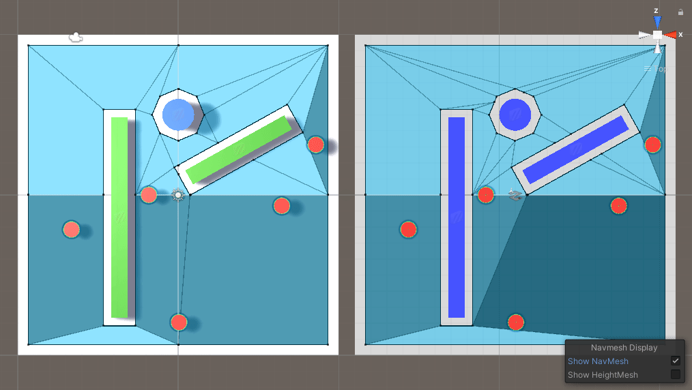
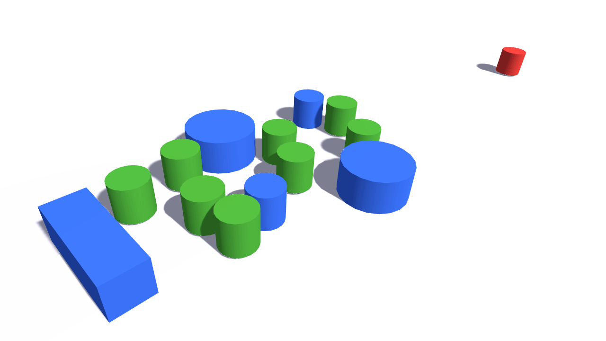

# Custom Nav Mesh

Alternative to Unity's NavMesh system where the __agents avoid the other non moving agents__ in their pathing. This still uses the official navigation system but you have to use it's components instead. Compatible with __NavMeshComponents__.

# How it works

__How do the agents avoid others?__ The Unity's __NavMeshAgent__ only goes around __NavMeshObstacles__ and ignores the other agents in their path. By disabling __NavMeshAgent__ and enabling __NavMeshObstacle__ when an agent is not moving noticeably, the agents now avoid other non moving agents in their pathing.

  
   

>__1. Set destination__ to blue target. __Unity's NavMeshAgent__ on the __left__, and __CustomNavMeshAgent__ on the __right__.

__What if a moving agent collides against a stopped agent that's currently in obstacle mode?__ Normally, it wouldn't be able to push it. However, if you:
* duplicate the baked surface, obstacle and agents
* make the duplicated agents switch between __NavMeshAgent__ and __NavMeshObstacle__ instead of the original ones
* have the original agent copy the duplicated one's velocity, and the duplicated one copy the original's position at every frame

You can have them push the others:

  

 

>__2.__ The duplicated __NavMesh__ components. The __hidden__ components are on the __right__ side.

That's what this __CustomNavMesh__ system does *under the hood*, you just have to use it's __custom components__, which are __identical to the original ones__, making the transition __seamless__.

  
   

>__3. Overlapping__ agents by throwing one against the others. The __agents__ are red and the __obstacles__ blue. __Unity's NavMeshAgent__ against agents that switched to __NavMeshObstacle__ on the __left__, and __CustomNavMeshAgents__ on the __right__. This is __just a showcase__, if you're trying to do something similar you should use __colliders__ and __physics__ instead since this system is simply used to __resolve agent overlap__.

Instead of doing this, why not just switch the obstacle to agent? That wouldn't work because that switch isn't instant, it takes at least two frames.

__What are the disadvantages?__ Every __NavMesh__ component is duplicated, which makes it less performant. It shouldn't be noticeable unless you have a lot of agents.

# Custom classes

__CustomNavMesh__ – you can choose the hidden game objects __relative position__ and whether or not they are __rendered__ by accessing the __class__ or through it's __singleton__ present in the __scene__.

  

 

>__4.__ Changing __CustomNavMesh__ fields.

* __CustomNavMeshSurface__ – add to each surface that is going to be baked. The __surfaces__ need to be __rendered meshes__. __Physics Colliders__ and __Terrains__ are ignored.
* __CustomNavMeshObstacle__ – replacement for __NavMeshObstacle__.
* __CustomNavMeshAgent__ – replacement for __NavMeshObstacle__. It has some added properties:
  * __Time to Block__ – time in __seconds needed__ for the agent __to start blocking__ (to make others go around it),  assuming it hasn't surpassed the __Unblock Speed Treshold__ during the interval.
  * __Unblock Speed Threshold__ – __speed at__ which the agent __stops blocking__ and moves instead.
  * __Block Refresh Interval__ – time in __seconds needed__ for the agent to __check__ if it should __stop blocking__.
  * __Min Distance Boost to Stop Block__ – When block is __refreshed__, this is the __minimum distance__ the newly calculated reachable position must be __closer__ for the agent to __stop blocking__.
  * __The rest__ have to do with the blocking obstacle carving and are identical to the __NavMeshObstacle carving settings__.

# How To Get Started

__Clone or download__ this repository and open the project in Unity.
Alternatively, you can __copy the contents__ of `Assets/CustomNavMesh` to an __existing project__.

The __scenes__ used for the __GIFs__ are available in the `Assets/Examples` folder. Just hit the __Space Bar__ in play mode to test it.

Note: This project was created using __Unity 2019.4 LTS__ version. Tested in __PC Standalone__, __Android__ and __WebGL__.

# Might implement later

* Every time an agent in block mode does a refresh (tries to see if it should unblock), __SamplePosition__ and __CalculatePath__ are called. Both of these functions are __synchronous__ and run on the __main thread__. I could divide them by the frames or make them run in separate threads to __avoid ms spikes__.
* Import more methods and properties from the __NavMesh__ and __NavMeshAgent__ to the __CustomNavMesh__ and to the __CustomNavMeshAgent__, respectively. 
* Create custom versions for the __NavMeshComponents__' components.

If you __need help__ implementing some of these or have any __question__, just __message me__ and I'll try to help. I'm also interested in any __tips__ or __suggestions__ you may have, cheers!
